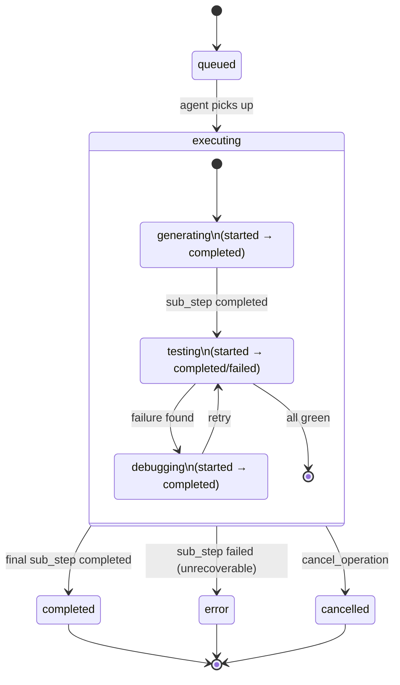

# Stateful Long-Running Operations in MCP

## Overview

This document formalizes the **stateful operation pattern** for MCP servers handling long-running, non-blocking tasks. It addresses a key gap in the MCP spec: *how should an MCP server handle operations that outlive a single request/response cycle?*

**Key Problem:** MCP's request/response model assumes quick turnaround. For operations like code generation, testing, or debugging—which may take minutes—the protocol needs explicit semantics for:
- Stable operation IDs for resumption
- Typed waiting states during execution
- Idempotent polling semantics
- Cancellation signaling
- Resume receipts capturing partial progress

This pattern is implemented in `cowork-to-code-bridge` and validated in production (Hermes, Open Claw, Crew.ai).

---

## Table of Contents

- [Core Concepts](#core-concepts)
  - [1. Operation ID (Stable, Idempotent)](#1-operation-id-stable-idempotent)
  - [2. Typed Waiting States](#2-typed-waiting-states)
  - [3. Idempotent Poll Semantics](#3-idempotent-poll-semantics)
  - [4. Cancellation Signaling](#4-cancellation-signaling)
  - [5. Resume Receipt (Partial Progress)](#5-resume-receipt-partial-progress)
    - [5.1 Resume Receipt Structure](#51-resume-receipt-structure)
    - [5.2 Examples](#52-examples)
    - [5.3 State Transitions with Sub-steps](#53-state-transitions-with-sub-steps)
    - [5.4 Recovery Patterns](#54-recovery-patterns)
- [Implementation: cowork-to-code-bridge](#implementation-cowork-to-code-bridge)
- [Design Decisions](#design-decisions)
- [Usage Patterns](#usage-patterns)
- [Guarantees & Trade-offs](#guarantees--trade-offs)
- [Extensibility](#extensibility)
- [Comparison: Other Frameworks](#comparison-other-frameworks)
- [Testing Strategy](#testing-strategy)
- [Production Safety: Metrics & Loop Detection](#production-safety-metrics--loop-detection)
- [Spec Compliance](#spec-compliance)
- [Reference Implementation](#reference-implementation)

---

## Core Concepts

### 1. Operation ID (Stable, Idempotent)

Every long-running operation gets a unique, stable identifier.

**Properties:**
- **Immutable** — doesn't change between requests
- **Unique** — no collisions across concurrent operations
- **Opaque to caller** — implementer chooses format (UUID, timestamp-hash, etc.)
- **Resumable** — if connection drops, same ID retrieves same operation state

**Format (recommended):**
```
{server-id}_{unix-timestamp}_{request-hash}_{sequence}
```

Example: `bridge_1718556000_a4f2c1_01`

**Usage:**
```json
{
  "jsonrpc": "2.0",
  "id": 1,
  "method": "tools/call",
  "params": {
    "name": "escalate_to_claude",
    "arguments": {
      "request": "Debug the API failure",
      "wait_seconds": 0,
      "operation_id": null  // Server generates if null
    }
  }
}
```

### 2. Typed Waiting States

An operation progresses through predictable states:

```
┌─────────────┐
│   QUEUED    │  Operation accepted, awaiting execution
└──────┬──────┘
       │
       ▼
┌─────────────┐
│  EXECUTING  │  Operation in progress (sub-states possible)
└──────┬──────┘
       │
       ├─────────▶ ┌─────────────┐
       │           │  COMPLETED  │  Finished with result
       │           └─────────────┘
       │
       └─────────▶ ┌─────────────┐
                   │   ERROR     │  Failed with error
                   └─────────────┘
```

**State Schema:**

```typescript
interface OperationState {
  operation_id: string;
  status: "queued" | "executing" | "completed" | "error" | "cancelled";
  created_at: number;           // unix timestamp
  updated_at: number;
  progress?: {
    step: string;               // human-readable phase
    percent_complete: number;   // 0-100, null if indeterminate
    message?: string;
  };
  result?: any;                 // set when status == "completed"
  error?: {
    code: string;               // error classification
    message: string;
    details?: Record<string, any>;
  };
}
```

### 3. Idempotent Poll Semantics

Polling for operation status must be **fully idempotent** — same request always returns same state.

**Pattern:**
```json
// Request (idempotent — no side effects)
{
  "jsonrpc": "2.0",
  "id": 2,
  "method": "tools/call",
  "params": {
    "name": "get_operation_status",
    "arguments": {
      "operation_id": "bridge_1718556000_a4f2c1_01"
    }
  }
}

// Response (cached if operation is finished)
{
  "jsonrpc": "2.0",
  "id": 2,
  "result": {
    "operation_id": "bridge_1718556000_a4f2c1_01",
    "status": "completed",
    "result": {
      "stdout": "...",
      "exit_code": 0
    },
    "completed_at": 1718556180
  }
}
```

**Guarantees:**
- ✅ Same operation_id always returns same state (until it transitions)
- ✅ Multiple concurrent polls don't cause duplicate work
- ✅ Polls don't have side effects (read-only)
- ✅ Network retries are safe

### 4. Cancellation Signaling

Operations can be cancelled if the caller changes its mind.

**Pattern:**
```json
// Request
{
  "jsonrpc": "2.0",
  "id": 3,
  "method": "tools/call",
  "params": {
    "name": "cancel_operation",
    "arguments": {
      "operation_id": "bridge_1718556000_a4f2c1_01",
      "reason": "Caller timeout exceeded"
    }
  }
}

// Response
{
  "jsonrpc": "2.0",
  "id": 3,
  "result": {
    "operation_id": "bridge_1718556000_a4f2c1_01",
    "status": "cancelled",
    "cancelled_at": 1718556120,
    "reason": "Caller timeout exceeded"
  }
}
```

**Semantics:**
- **Before execution starts:** Operation skips immediately, state → "cancelled"
- **During execution:** Server begins graceful shutdown (SIGTERM, not SIGKILL)
- **After completion:** Cancellation request is idempotent (no change)

### 5. Resume Receipt (Partial Progress)

When an operation is paused or interrupted, the **resume receipt** captures enough
state to resume from where execution stopped — rather than restarting from scratch.

Every operation is seeded with an empty resume receipt at `escalate_to_claude` time,
and `get_operation_status` always returns a **complete, normalized** receipt (every
field present, even on legacy state). The receipt has two first-class collections:

- **`sub_steps`** — the execution phases the operation moved through (e.g.
  `generating` → `testing` → `debugging`), each timestamped and checkpointed.
- **`artifacts`** — the concrete files/code the operation produced, so a resuming
  agent knows what already exists on disk and need not recreate it.

**Use cases:**
- Agent disconnects mid-operation → resume from the last incomplete sub-step
- Timeout on first try → resume with the generated artifacts intact
- Multi-stage workflows → pause between stages, audit progress, then continue
- Loop / budget kill → inspect which sub-step burned the budget before retrying

#### 5.1 Resume Receipt Structure

Full TypeScript schema as returned by `get_operation_status`:

```typescript
interface ResumeReceipt {
  /** Opaque id of the most recent checkpoint; null until first checkpoint. */
  checkpoint_id: string | null;

  /** Free-form context the resuming agent needs (cwd, branch, vars, ...). */
  context: Record<string, any>;

  /** Ordered execution phases. Append-only; the last entry is the live phase. */
  sub_steps: SubStep[];

  /** Files / code produced so far. A resuming agent can trust these exist. */
  artifacts: Artifact[];

  /** True when `resume_from` points at an actionable, incomplete sub-step. */
  can_resume: boolean;

  /** Name of the sub-step to resume at; null when nothing to resume. */
  resume_from: string | null;
}

interface SubStep {
  /** Phase name, e.g. "generating" | "testing" | "debugging". */
  name: string;

  /** Lifecycle of this phase. */
  status: "started" | "completed" | "failed";

  /** Wall-clock duration once finished; null while still "started". */
  duration_ms: number | null;

  /** Phase-local checkpoint payload (counts, cursors, partial output). */
  checkpoint_data: Record<string, any>;
}

interface Artifact {
  /** Path relative to the operation's working directory. */
  path: string;

  /** Artifact kind, e.g. "python" | "markdown" | "diff" | "binary". */
  type: string;

  /** Size in bytes (null if not yet flushed to disk). */
  size_bytes: number | null;

  /** Unix timestamp (seconds) when the artifact was last written. */
  timestamp: number | null;
}
```

**Field contracts:**

| Field | Guarantee |
|---|---|
| `sub_steps` | Append-only & ordered. At most one trailing `started` entry. |
| `sub_steps[].status` | Transitions `started → completed` or `started → failed`. Never reopens. |
| `artifacts` | Each `path` is unique; re-writing a path updates `size_bytes`/`timestamp` in place. |
| `can_resume` | `true` ⟺ `resume_from` names an existing sub-step not yet `completed`. |
| All fields | Always present in the `get_operation_status` response (back-filled if missing on disk). |

#### 5.2 Examples

**Example A — Test execution (mid-run, one suite failing):**

```json
{
  "operation_id": "bridge_1718556000_a4f2c1_01",
  "status": "executing",
  "resume_receipt": {
    "checkpoint_id": "chk_tests_3of5",
    "context": { "cwd": "/repo", "runner": "pytest", "seed": 1234 },
    "sub_steps": [
      { "name": "collect", "status": "completed", "duration_ms": 320,
        "checkpoint_data": { "tests_found": 48 } },
      { "name": "run_unit", "status": "completed", "duration_ms": 8400,
        "checkpoint_data": { "passed": 42, "failed": 0 } },
      { "name": "run_integration", "status": "failed", "duration_ms": 15200,
        "checkpoint_data": { "passed": 4, "failed": 1, "failing": "test_api_health" } }
    ],
    "artifacts": [
      { "path": ".pytest_cache/lastfailed", "type": "json", "size_bytes": 64,
        "timestamp": 1718556180 },
      { "path": "junit-report.xml", "type": "xml", "size_bytes": 9120,
        "timestamp": 1718556181 }
    ],
    "can_resume": true,
    "resume_from": "run_integration"
  }
}
```

**Example B — Code generation (paused after writing source, before tests):**

```json
{
  "operation_id": "bridge_1718556100_b7e3d2_01",
  "status": "executing",
  "resume_receipt": {
    "checkpoint_id": "chk_codegen_done",
    "context": { "cwd": "/repo", "language": "python", "module": "parser" },
    "sub_steps": [
      { "name": "design", "status": "completed", "duration_ms": 2100,
        "checkpoint_data": { "approach": "recursive-descent" } },
      { "name": "generating", "status": "completed", "duration_ms": 4200,
        "checkpoint_data": { "lines_written": 120, "functions": 6 } },
      { "name": "testing", "status": "started", "duration_ms": null,
        "checkpoint_data": { "harness": "pytest", "written": false } }
    ],
    "artifacts": [
      { "path": "parser.py", "type": "python", "size_bytes": 3120,
        "timestamp": 1718556140 }
    ],
    "can_resume": true,
    "resume_from": "testing"
  }
}
```

**Example C — Debugging workflow (iterating on a fix):**

```json
{
  "operation_id": "bridge_1718556200_c9f1a4_01",
  "status": "executing",
  "resume_receipt": {
    "checkpoint_id": "chk_debug_iter2",
    "context": { "cwd": "/repo", "bug": "off-by-one in tokenizer", "branch": "fix/tok" },
    "sub_steps": [
      { "name": "reproduce", "status": "completed", "duration_ms": 1500,
        "checkpoint_data": { "repro": "test_tokenize_empty" } },
      { "name": "diagnose", "status": "completed", "duration_ms": 3300,
        "checkpoint_data": { "root_cause": "loop bound uses <= not <" } },
      { "name": "patch", "status": "completed", "duration_ms": 900,
        "checkpoint_data": { "hunk": "tokenizer.py:88" } },
      { "name": "verify", "status": "started", "duration_ms": null,
        "checkpoint_data": { "iteration": 2, "last_result": "1 failing" } }
    ],
    "artifacts": [
      { "path": "tokenizer.py", "type": "python", "size_bytes": 5400,
        "timestamp": 1718556260 },
      { "path": "fix.diff", "type": "diff", "size_bytes": 412,
        "timestamp": 1718556261 }
    ],
    "can_resume": true,
    "resume_from": "verify"
  }
}
```

#### 5.3 State Transitions with Sub-steps

The operation-level status (§2) is the outer state machine. Within `executing`,
the `sub_steps` array is an inner, append-only timeline. Each sub-step runs its own
`started → completed | failed` lifecycle:



ASCII rendering of the inner sub-step timeline (what `resume_from` points at):

```
status = executing
                                                     can_resume = true
  ┌────────────┐   ┌────────────┐   ┌────────────┐   resume_from ─┐
  │ generating │──▶│  testing   │──▶│ debugging  │ ◀──────────────┘
  │ completed  │   │ completed  │   │  started   │  ← live phase
  │ 4200 ms    │   │ 1800 ms    │   │   (—)      │
  └────────────┘   └────────────┘   └────────────┘
        │                │                 │
     artifact         artifact          (in-flight)
    parser.py       test_parser.py
```

On resume, the agent reads the receipt, skips every `completed` sub-step, trusts the
listed `artifacts` already exist, and re-enters at `resume_from`.

#### 5.4 Recovery Patterns

**Resume from the first incomplete sub-step:**

```python
def resume(mcp, operation_id):
    status = mcp.call_tool("get_operation_status", {"operation_id": operation_id})
    receipt = status["resume_receipt"]

    if not receipt["can_resume"]:
        return status  # nothing to resume — already done or never started

    # Everything completed is trusted; pick up at the live/failed phase.
    done = {s["name"] for s in receipt["sub_steps"] if s["status"] == "completed"}
    existing = {a["path"] for a in receipt["artifacts"]}

    return mcp.call_tool("escalate_to_claude", {
        "request": (
            f"Resume operation {operation_id} at step '{receipt['resume_from']}'. "
            f"Already completed: {sorted(done)}. "
            f"Existing artifacts (do not recreate): {sorted(existing)}. "
            f"Context: {receipt['context']}"
        ),
        "operation_id": operation_id,   # same id = resume, not a new op
        "wait_seconds": 300,
    })
```

**Retry only the failed sub-step (leave completed work untouched):**

```python
def retry_failed_substep(mcp, operation_id, max_attempts=3):
    for attempt in range(max_attempts):
        status = mcp.call_tool("get_operation_status", {"operation_id": operation_id})
        receipt = status["resume_receipt"]
        failed = [s for s in receipt["sub_steps"] if s["status"] == "failed"]
        if not failed:
            return status  # no failures left

        step = failed[-1]
        mcp.call_tool("escalate_to_claude", {
            "request": (
                f"Re-run failed step '{step['name']}'. "
                f"Last checkpoint: {step['checkpoint_data']}. "
                f"Attempt {attempt + 1}/{max_attempts}."
            ),
            "operation_id": operation_id,
            "wait_seconds": 180,
        })
    raise RuntimeError(f"{operation_id}: step still failing after {max_attempts} attempts")
```

**MCP client: poll, surface progress, and act on the receipt:**

```python
import time

def run_with_progress(mcp, request, poll_every=30, deadline_s=1800):
    # Fire and forget — get an operation_id back immediately.
    op = mcp.call_tool("escalate_to_claude", {"request": request, "wait_seconds": 0})
    operation_id = op["operation_id"]

    end = time.time() + deadline_s
    while time.time() < end:
        status = mcp.call_tool("get_operation_status", {"operation_id": operation_id})
        receipt = status["resume_receipt"]

        # Human-readable progress from sub_steps.
        for s in receipt["sub_steps"]:
            mark = {"completed": "✓", "failed": "✗", "started": "…"}[s["status"]]
            dur = f"{s['duration_ms']}ms" if s["duration_ms"] is not None else "—"
            print(f"  {mark} {s['name']} ({dur})")

        if status["status"] == "completed":
            return status["result"]
        if status["status"] == "error":
            # Hand the receipt to a recovery routine instead of failing hard.
            return resume(mcp, operation_id)

        time.sleep(poll_every)

    # Deadline hit — checkpoint is on disk; caller can resume later by id.
    print(f"Deadline hit; resume later with operation_id={operation_id}")
    return resume(mcp, operation_id)
```

---

## Implementation: cowork-to-code-bridge

### Tool: `escalate_to_claude` (with stateful semantics)

```json
{
  "name": "escalate_to_claude",
  "description": "Hand a task to Claude Code; track execution asynchronously",
  "inputSchema": {
    "type": "object",
    "properties": {
      "request": {
        "type": "string",
        "description": "Task to delegate to Claude Code"
      },
      "wait_seconds": {
        "type": "integer",
        "default": 0,
        "description": "Max time to wait for result (0 = return immediately with operation_id)"
      },
      "operation_id": {
        "type": "string",
        "nullable": true,
        "description": "Resume an existing operation; null = create new"
      }
    },
    "required": ["request"]
  }
}
```

### Tool: `get_operation_status` (NEW)

```json
{
  "name": "get_operation_status",
  "description": "Check status of a long-running operation",
  "inputSchema": {
    "type": "object",
    "properties": {
      "operation_id": {
        "type": "string",
        "description": "Operation ID to poll"
      }
    },
    "required": ["operation_id"]
  }
}
```

### Tool: `cancel_operation` (NEW)

```json
{
  "name": "cancel_operation",
  "description": "Cancel a running operation",
  "inputSchema": {
    "type": "object",
    "properties": {
      "operation_id": {
        "type": "string",
        "description": "Operation to cancel"
      },
      "reason": {
        "type": "string",
        "description": "Reason for cancellation"
      }
    },
    "required": ["operation_id"]
  }
}
```

### File Structure

**Queue (in `~/.cowork-to-code-bridge/`):**
```
queue/
  op_bridge_1718556000_a4f2c1_01.json      # Pending operation
  
operations/
  bridge_1718556000_a4f2c1_01.json         # State + checkpoint
  bridge_1718556000_a4f2c1_01.log          # Streaming output
  
results/
  bridge_1718556000_a4f2c1_01.json         # Final result (cached)
```

**Operation State File:**
```json
{
  "operation_id": "bridge_1718556000_a4f2c1_01",
  "status": "executing",
  "created_at": 1718556000,
  "updated_at": 1718556045,
  "request": "Debug the API failure",
  "progress": {
    "step": "Running tests...",
    "percent_complete": 65,
    "message": "Test 4/6 passed"
  },
  "execution_details": {
    "started_at": 1718556005,
    "pid": 12345
  },
  "resume_receipt": {
    "checkpoint_id": "chk_67890",
    "context": {
      "current_test": "test_api_health"
    },
    "sub_steps": [
      { "name": "collect", "status": "completed", "duration_ms": 320,
        "checkpoint_data": { "tests_found": 6 } },
      { "name": "run_tests", "status": "started", "duration_ms": null,
        "checkpoint_data": { "tests_passed": 4, "tests_failed": 0 } }
    ],
    "artifacts": [
      { "path": "junit-report.xml", "type": "xml", "size_bytes": 9120,
        "timestamp": 1718556045 }
    ],
    "can_resume": true,
    "resume_from": "run_tests"
  }
}
```

> **Initialization:** `escalate_to_claude` seeds `resume_receipt` with empty
> `sub_steps`/`artifacts` (and `can_resume: false`). The executing agent appends to
> these as it works. `get_operation_status` always returns a fully-normalized receipt
> — operation state written before these fields existed is back-filled on read, so
> new fields are strictly additive and backward compatible. See
> `_build_resume_receipt` in `cowork_to_code_bridge/mcp_server.py`.

---

## Design Decisions

### Why File-Based Queue (not in-memory)?

| Factor | File-Based | In-Memory |
|---|---|---|
| **Crash Recovery** | ✅ State survives daemon restart | ❌ Lost on crash |
| **Multi-Process Access** | ✅ Safe via atomic writes | ❌ Requires IPC/mutex |
| **Auditability** | ✅ Full state history on disk | ❌ Hidden in memory |
| **Cross-Tool Integration** | ✅ Scripts, MCPs, direct files all see same state | ❌ MCP-only |

**Decision:** File-based for resilience and auditability.

### Why Polling (not Webhooks)?

| Factor | Polling | Webhooks |
|---|---|---|
| **Complexity** | ✅ Simple (read file) | ❌ Network server, TLS, auth |
| **Firewall-Friendly** | ✅ Works behind NAT/firewall | ❌ Requires inbound port |
| **Late Binding** | ✅ Caller decides when to check | ❌ Must provide callback upfront |
| **Error Recovery** | ✅ Caller controls retry logic | ❌ Lost if callback unreachable |

**Decision:** Polling for simplicity and robustness.

### Why Separate Operation State from Result?

- **Querying during execution** → `operations/<id>.json` has progress, checkpoint
- **After completion** → Both files exist (state is cache-warm)
- **Garbage collection** → Results can be pruned after 7 days; operations kept longer for audit

---

## Usage Patterns

### Pattern 1: Fire-and-Forget (Immediate Return)

```python
# Caller doesn't wait
response = mcp.call_tool("escalate_to_claude", {
    "request": "Run the full test suite",
    "wait_seconds": 0  # Return immediately
})
# response = {
#   "operation_id": "bridge_..._01",
#   "status": "queued"
# }

# Check back later
for i in range(10):
    status = mcp.call_tool("get_operation_status", {
        "operation_id": "bridge_..._01"
    })
    if status["status"] in ["completed", "error"]:
        break
    time.sleep(30)  # Poll every 30s
```

### Pattern 2: Wait with Timeout

```python
# Caller waits up to 300 seconds
response = mcp.call_tool("escalate_to_claude", {
    "request": "Debug the API",
    "wait_seconds": 300  # Block for 5 min max
})
# If server responds before timeout: result is in response["result"]
# If timeout: response["status"] = "executing", response["operation_id"] present
```

### Pattern 3: Resume from Checkpoint

```python
# First attempt timed out; resume with context
response = mcp.call_tool("escalate_to_claude", {
    "request": "Debug the API (resume from checkpoint)",
    "operation_id": "bridge_..._01",  # Same operation_id = resume
    "wait_seconds": 300
})
# Server sees existing operation → uses checkpoint → continues from there
```

### Pattern 4: Graceful Cancellation

```python
# Operation taking too long; cancel it
cancel_response = mcp.call_tool("cancel_operation", {
    "operation_id": "bridge_..._01",
    "reason": "Exceeded caller's SLA"
})
# If not started: immediate cancellation
# If running: SIGTERM sent to process, waits 10s for graceful shutdown
```

---

## Guarantees & Trade-offs

### Guarantees Provided

| Guarantee | Why | Implication |
|---|---|---|
| **Stable Operation IDs** | Deterministic hash of request | Same request = resumable state |
| **Idempotent Polling** | Read-only queries, cached results | Safe to retry, no side effects |
| **Atomic State Transitions** | Write-ahead logging + atomic rename | No partial updates |
| **Crash Recovery** | State preserved to disk | Survives daemon/system restarts |
| **Ordered Execution** | FIFO queue for operations | Fair scheduling, LIFO within operation |

### Trade-offs Accepted

| Trade-off | Why | When It Matters |
|---|---|---|
| **No Real-Time Push** | Polling is simpler, more robust | Latency-sensitive apps (100ms deadline) |
| **No Shared Memory** | File-based state is slower | >1000 concurrent operations |
| **Timeout Always Finishes** | Can't distinguish "slow" from "stuck" | Need SLA < operation's natural duration |
| **Cancellation Is Best-Effort** | No guarantee process stops immediately | Safety-critical operations |

---

## Extensibility

### Adding Progress Callbacks

Future: Agent can write progress deltas to `operations/<id>.log`, streamed to caller.

```json
// Streamed line-by-line
{"event": "step_started", "step": "code_generation", "timestamp": 1718556010}
{"event": "step_progress", "percent": 25, "message": "Analyzing error", "timestamp": 1718556015}
{"event": "step_completed", "step": "code_generation", "timestamp": 1718556020}
```

### Adding Rate Limiting

Per-agent quota system (planned for Phase 4):

```json
{
  "operation_id": "bridge_..._01",
  "status": "queued",
  "queue_position": 3,
  "queue_reason": "Rate limit reached: 5/10 operations in progress for agent X",
  "estimated_wait_seconds": 45
}
```

### Adding Sub-Operations

Complex operations can spawn child operations (tree structure):

```json
{
  "operation_id": "bridge_..._01",
  "status": "executing",
  "child_operations": [
    "bridge_..._02",  // Generate code
    "bridge_..._03"   // Run tests
  ],
  "progress": {
    "percent_complete": 50,
    "message": "Waiting for child operations"
  }
}
```

---

## Comparison: Other Frameworks

### LangChain RunAsync / AgentExecutor

- ✅ Similar async pattern (queue + poll)
- ❌ No explicit operation IDs (uses internal refs)
- ❌ No resumption from checkpoint
- ❌ Tightly coupled to LangChain (not portable)

### Crew.ai Tools

- ✅ Tool-based delegation
- ❌ No async semantics (blocks agent)
- ❌ No state persistence
- ❌ Single-threaded execution

### Temporal/Durable Execution Engines

- ✅ Full async + resumption semantics
- ✅ Checkpoint system
- ❌ Heavyweight (requires Temporal server)
- ❌ Learning curve (workflow DSL)

### This Pattern

- ✅ Lightweight (files + simple polling)
- ✅ Explicit operation model (not hidden)
- ✅ First-class checkpoints (resumable)
- ✅ Portable (any MCP client)
- ❌ Manual polling (not event-driven)

---

## Testing Strategy

### Unit Tests

- ✅ Operation ID generation (uniqueness)
- ✅ State transitions (valid paths only)
- ✅ Idempotent polling (same result after multiple calls)
- ✅ Atomic file updates (no corruption)
- ✅ Cancellation (both pre- and during execution)

### Integration Tests

- ✅ End-to-end escalation (MCP → Queue → Agent → Result)
- ✅ Checkpoint recovery (operation resumes with context)
- ✅ Concurrent operations (multiple agents escalate simultaneously)
- ✅ Network failures (dropped connection, retry works)
- ✅ Process death (daemon crashes, state recovered)

---

---

## Production Safety: Metrics & Loop Detection

For production crews (e.g., CrewAI running on cloud infrastructure), the pattern includes built-in safeguards to prevent runaway operations.

### Per-Operation Metrics

Every operation state file includes:

```json
{
  "operation_id": "bridge_1718556000_a4f2c1_01",
  "status": "executing",
  "metrics": {
    "tool_calls": 12,
    "tool_call_log": [
      {"tool": "search_docs", "args": {...}, "ts": 1718556010},
      {"tool": "search_docs", "args": {...}, "ts": 1718556011},
      {"tool": "search_docs", "args": {...}, "ts": 1718556012}
    ],
    "api_spend_estimate": 0.24,
    "memory_mb": 256,
    "cpu_percent": 18
  }
}
```

**`get_operation_status` response includes metrics:**

```json
{
  "operation_id": "bridge_1718556000_a4f2c1_01",
  "status": "executing",
  "progress": {...},
  "metrics": {
    "tool_calls": 12,
    "api_spend_estimate": 0.24,
    "memory_mb": 256,
    "cpu_percent": 18,
    "repeated_calls": {
      "search_docs": 3
    }
  },
  "quota": {...}
}
```

### Loop Detection

The MCP server automatically detects infinite retry patterns:

- **Repeated calls:** Same tool invoked 3+ times with identical arguments
- **Same error:** Error thrown repeatedly without progress
- **Resource exhaustion:** Memory or CPU exceeding thresholds

**How crews respond:**

```python
# Check metrics during execution
status = mcp.call_tool("get_operation_status", {"operation_id": op_id})

if status["metrics"]["repeated_calls"]:
    # Infinite loop detected
    print(f"Loop detected: {status['metrics']['repeated_calls']}")
    mcp.call_tool("cancel_operation", {
        "operation_id": op_id,
        "reason": f"Loop detected in {list(status['metrics']['repeated_calls'].keys())[0]}"
    })

if status["metrics"]["api_spend_estimate"] > budget_limit:
    # Budget exceeded
    mcp.call_tool("cancel_operation", {
        "operation_id": op_id,
        "reason": f"Budget exceeded: ${status['metrics']['api_spend_estimate']:.2f}"
    })
```

### Recording Metrics (Agent Responsibility)

Claude Code agents populate metrics during execution:

1. **After each tool call:** Append to `tool_call_log` with tool name, args, timestamp
2. **Periodically:** Update `cpu_percent`, `memory_mb` from system stats
3. **On completion:** Calculate final `api_spend_estimate` (tokens × rate)

Example (pseudo-code in Claude Code):

```python
# During operation execution
op_state = json.load(f"{operation_id}.json")

# Record a tool call
op_state["metrics"]["tool_call_log"].append({
    "tool": "search_docs",
    "args": {"query": "authentication"},
    "ts": time.time()
})
op_state["metrics"]["tool_calls"] += 1

# Update resource metrics
op_state["metrics"]["memory_mb"] = get_memory_usage()
op_state["metrics"]["cpu_percent"] = get_cpu_usage()

# Write back
json.dump(op_state, f"{operation_id}.json")
```

---

## Spec Compliance

This pattern extends the **MCP v1.0 specification** (as of June 2026):

| MCP Concept | How Pattern Uses It |
|---|---|
| **tools/call** | Invokes `escalate_to_claude`, `get_operation_status`, `cancel_operation` |
| **Request/Response** | Standard JSONRPC 2.0 wrapping (no changes) |
| **Error Handling** | Uses JSONRPC error codes (-32603, -32601, etc.) |
| **Streaming** | Future: `logs/<operation_id>.log` for progress events |

---

## Reference Implementation

**Files:**
- `cowork_to_code_bridge/mcp_server.py` — MCP server with stateful tools
- `tests/test_mcp_server.py` — Unit + integration tests
- `docs/EXTERNAL_AGENT_INTEGRATION.md` — Integration guide for Hermes/Open Claw
- `examples/hermes-mcp-config.json` — Configuration example

**Status:** Production (v0.5.0+), tested with Hermes, Open Claw, Crew.ai

---

## Further Reading

- [MCP Specification](https://modelcontextprotocol.io/specification)
- [EXTERNAL_AGENT_INTEGRATION.md](./EXTERNAL_AGENT_INTEGRATION.md) — How to use with frameworks
- [MCP_SERVER_IMPLEMENTATION.md](./MCP_SERVER_IMPLEMENTATION.md) — Architecture details
- [SECURITY.md](../SECURITY.md) — Threat model
